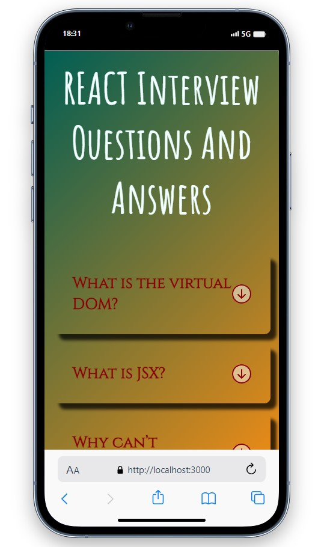
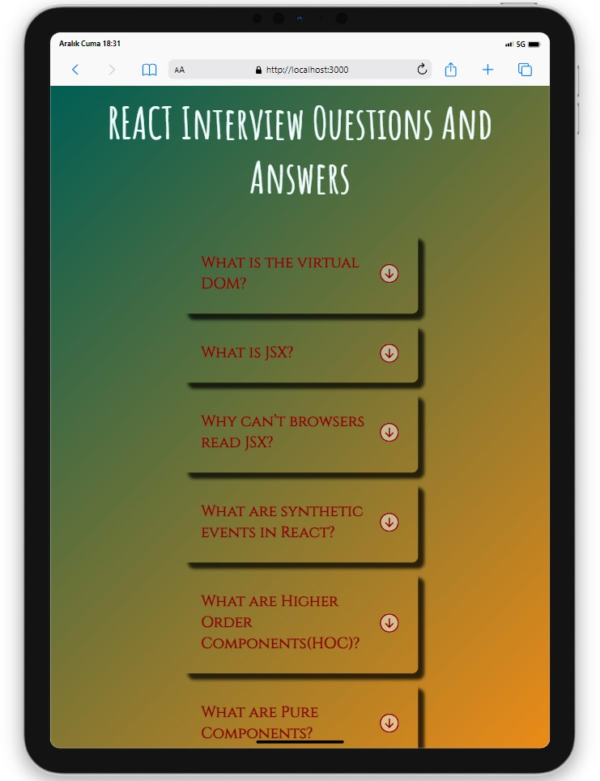
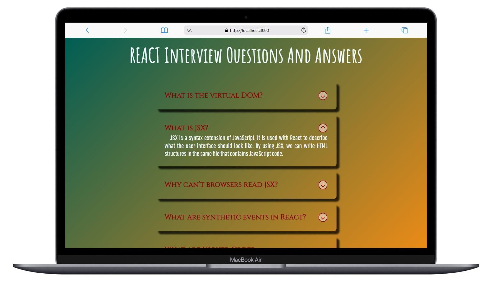

# Interview Accordion

<div align="center">
  
</div>

## About the Project

This project includes a web application that provides an accordion list of commonly asked interview questions and their corresponding answers.

## Live Project Link

You can access the live version of the project [here]().

## Features

- A list of frequently asked interview questions
- An accordion interface displaying answers to the questions
- Filtering capability for users to filter questions by categories

## Project Skeleton

```
Interview-Accordion (folder)
|
|----readme.md         
SOLUTION
├── public
│     └── index.html
├── src
│   ├── App.css
│   ├── App.js
│   ├── assets
│   │   └── [images]
│   ├── components
│   │   ├── Question.jsx
│   │   ├── Header.jsx
│   │   └── InterviewAccord.jsx
│   ├── helper
│   │   ├── data.js
│   │   └── icons.js
│   └── index.js
├── package.json
└── package-lock.json

```

## Screenshots

<div align="center">
  
  
  
</div>

## Compatibility

The project is compatible with both wide-screen computers and mobile devices.